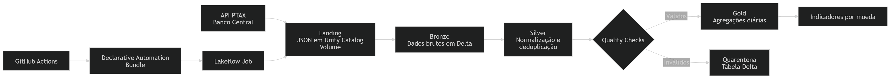
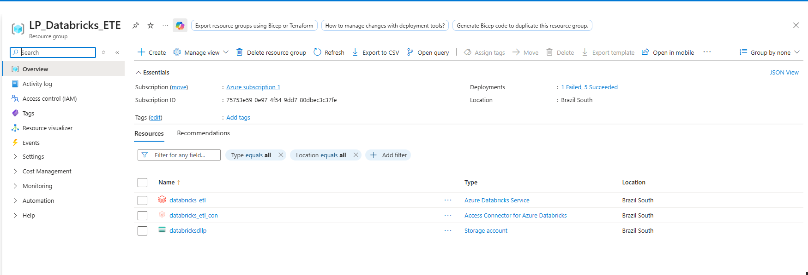
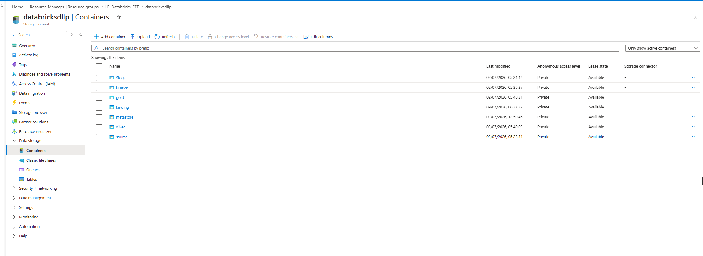
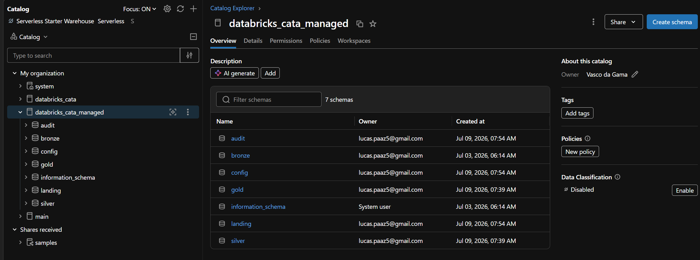
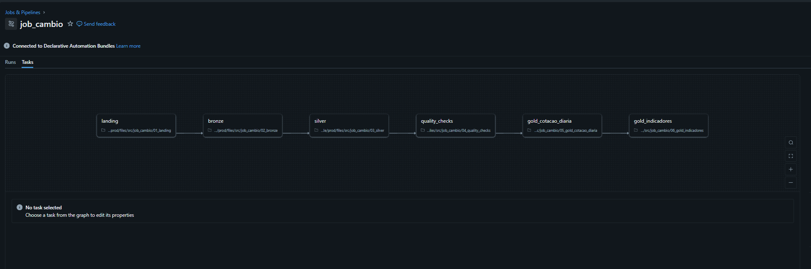

# Pipeline de Cotações PTAX com Azure Databricks

Pipeline de dados desenvolvido para realizar a ingestão, transformação,
validação e disponibilização das cotações PTAX fornecidas pelo Banco
Central do Brasil.

O projeto utiliza Azure Databricks, PySpark, Delta Lake e uma arquitetura
em camadas. A execução é orquestrada pelo Lakeflow Jobs, enquanto os
recursos do Databricks são definidos por Declarative Automation Bundles,
com validação e deploy automatizados pelo GitHub Actions.

---

## Objetivo

Construir um pipeline incremental e idempotente para processar as
cotações de moedas estrangeiras, mantendo dados históricos e
disponibilizando indicadores consolidados para consumo analítico.

Moedas processadas:

- USD
- EUR
- GBP
- JPY
- CAD
- AUD

---

## Tecnologias utilizadas

- Azure Databricks
- Azure Data Lake Storage Gen2
- Apache Spark
- PySpark
- Python
- Delta Lake
- Unity Catalog
- Unity Catalog Volumes
- Lakeflow Jobs
- Declarative Automation Bundles
- GitHub Actions
- API PTAX do Banco Central

---

## Arquitetura da solução



O pipeline consome as cotações PTAX disponibilizadas pelo Banco Central
e armazena os arquivos JSON originais na camada Landing, utilizando um
Unity Catalog Volume associado ao Azure Data Lake Storage Gen2.

Na camada Bronze, os dados brutos são persistidos em tabelas Delta. Na
camada Silver, são realizadas a normalização, a tipagem e a deduplicação
dos registros.

Antes da carga da camada Gold, os dados passam por verificações de
qualidade. Os registros válidos alimentam as tabelas analíticas, enquanto
os registros inválidos são direcionados para uma tabela Delta de
quarentena.

A execução das etapas é orquestrada por um Lakeflow Job. O código e as
configurações do Databricks são versionados no GitHub e implantados por
GitHub Actions utilizando Declarative Automation Bundles.

---

## Fluxo do pipeline

1. **Landing:** consumo da API PTAX e armazenamento das respostas em arquivos JSON.
2. **Bronze:** persistência dos dados brutos em tabelas Delta.
3. **Silver:** normalização, tipagem e deduplicação dos registros.
4. **Quality Checks:** validação dos dados e direcionamento de registros inválidos para quarentena.
5. **Gold — Cotação diária:** geração das agregações diárias por moeda.
6. **Gold — Indicadores:** geração de métricas consolidadas por moeda.

---

## Funcionalidades

- Carga incremental
- Processamento idempotente com `MERGE`
- Deduplicação por chave natural
- Controle de schema
- Quality checks
- Quarentena de registros inválidos
- Arquitetura em camadas
- Orquestração com dependências entre tarefas
- Configuração de retries e timeouts
- Controle de concorrência
- Fila de execução
- Execução agendada
- Notificação em caso de falha
- Alerta para execuções com duração excessiva
- Versionamento dos recursos do Databricks
- CI/CD com GitHub Actions

---

## Idempotência

O pipeline utiliza operações `MERGE` do Delta Lake para permitir a
reexecução do mesmo período sem gerar registros duplicados.

| Camada | Chave utilizada |
|---|---|
| Bronze | `batch_id + moeda` |
| Silver | `codigo_moeda + data_hora_cotacao + tipo_boletim` |
| Gold — Cotação diária | `codigo_moeda + data_cotacao` |

---

## Estrutura do repositório

```text
projeto_cambio_databricks/
├── .github/
│   └── workflows/
│       └── databricks-cicd.yml
│
├── docs/
│   └── images/
│       ├── mermaid-diagram.png
│       ├── image_1784677871190.png
│       ├── image_1784677936381.png
│       ├── image_1784897162017.png
│       └── image_1784677741156.png
│
├── resources/
│   └── job_cambio.job.yml
│
├── src/
│   └── job_cambio/
│       ├── 01_landing.ipynb
│       ├── 02_bronze.ipynb
│       ├── 03_silver.ipynb
│       ├── 04_quality_checks.ipynb
│       ├── 05_gold_cotacao_diaria.ipynb
│       └── 06_gold_indicadores.ipynb
│
├── databricks.yml
├── .gitignore
└── README.md
```

Principais diretórios e arquivos:

- `.github/workflows`: definição do pipeline de CI/CD com GitHub Actions.
- `docs/images`: diagramas e evidências utilizadas na documentação.
- `resources`: definição do Lakeflow Job utilizada pelo Bundle.
- `src/job_cambio`: notebooks responsáveis pelas etapas do pipeline.
- `databricks.yml`: configuração principal do Declarative Automation Bundle.

---

## Infraestrutura no Azure

O ambiente utiliza os seguintes recursos:

- Azure Databricks Workspace
- Access Connector for Azure Databricks
- Azure Data Lake Storage Gen2
- Unity Catalog
- Containers separados por camada



---

## Organização do Azure Data Lake

Os dados são organizados fisicamente nos seguintes containers:

- `landing`
- `bronze`
- `silver`
- `gold`
- `metastore`



---

## Governança e organização com Unity Catalog

O projeto utiliza o Unity Catalog para organizar e governar os dados
processados pelo pipeline.

Os objetos estão distribuídos nos seguintes schemas:

- `landing`
- `bronze`
- `silver`
- `gold`
- `audit`
- `config`

Essa organização separa os dados por camada e facilita a descoberta dos
objetos, o gerenciamento das tabelas e volumes e a aplicação de
permissões.



---

## Orquestração no Azure Databricks

O pipeline é orquestrado por um Lakeflow Job composto pelas seguintes
tarefas:

- `01_landing`
- `02_bronze`
- `03_silver`
- `04_quality_checks`
- `05_gold_cotacao_diaria`
- `06_gold_indicadores`

As tarefas possuem dependências entre si e são executadas em sequência
somente após o sucesso da etapa anterior.

O Job também possui:

- Até duas tentativas de reprocessamento por tarefa
- Intervalo de cinco minutos entre tentativas
- Timeout individual por tarefa
- Timeout máximo para o Job completo
- Controle de concorrência
- Fila para novas execuções
- Execução agendada
- Notificação em caso de falha
- Alerta para duração excessiva



---

## CI/CD com GitHub Actions

O projeto utiliza GitHub Actions para validar e realizar o deploy do
Declarative Automation Bundle no Azure Databricks.

O fluxo de CI/CD utiliza a Databricks CLI para:

1. Validar a configuração do Bundle.
2. Realizar o deploy dos notebooks e recursos.
3. Criar ou atualizar o Lakeflow Job no workspace.

As credenciais utilizadas pelo workflow são armazenadas por meio de
GitHub Secrets, evitando a exposição de tokens no repositório.

---

## Validação e deploy

O projeto possui um target `prod` configurado no Declarative Automation Bundle.

Para validar a configuração do Bundle:

```bash
databricks bundle validate -t prod
```

Para realizar o deploy dos notebooks e recursos:

```bash
databricks bundle deploy -t prod
```

Para executar o Lakeflow Job pelo Bundle:

```bash
databricks bundle run job_cambio -t prod
```

---

## Principais conceitos aplicados

- Arquitetura em camadas
- Processamento distribuído com PySpark
- Tabelas Delta
- Operações `MERGE`
- Carga incremental
- Idempotência
- Deduplicação
- Controle de schema
- Quality checks
- Quarentena de registros
- Orquestração de pipelines
- Governança com Unity Catalog
- Versionamento de código
- CI/CD
- Monitoramento de execução

---

## Melhorias futuras

- Parametrização de datas para reprocessamento e backfill
- Testes automatizados das transformações
- Infraestrutura como código para os recursos do Azure
- Dashboard para consumo das tabelas Gold
- Monitoramento de custos do ambiente
- Otimização periódica das tabelas Delta